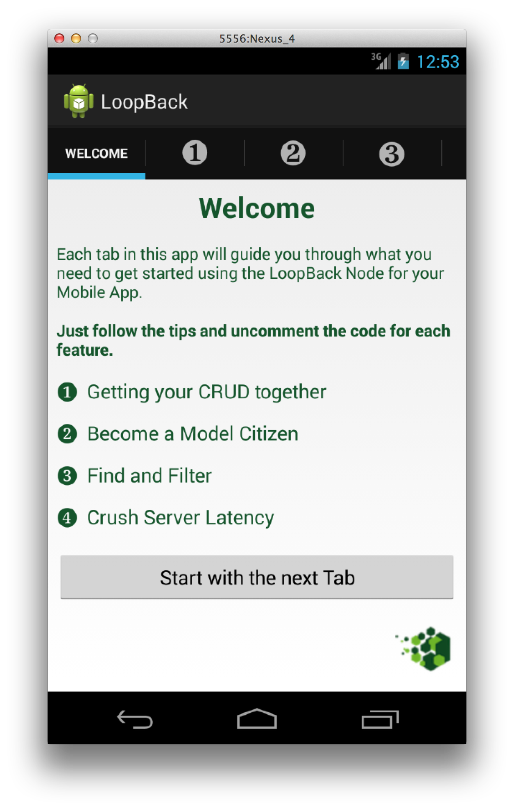
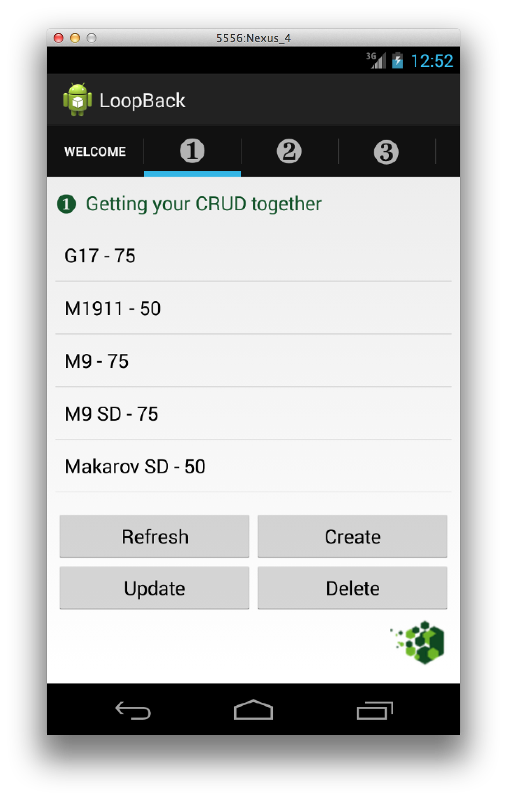
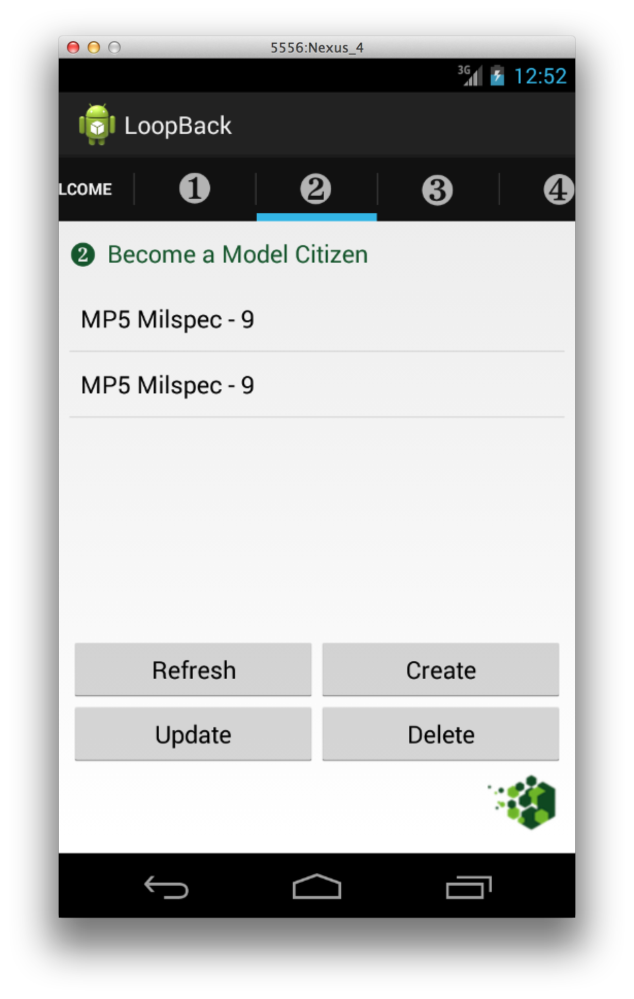
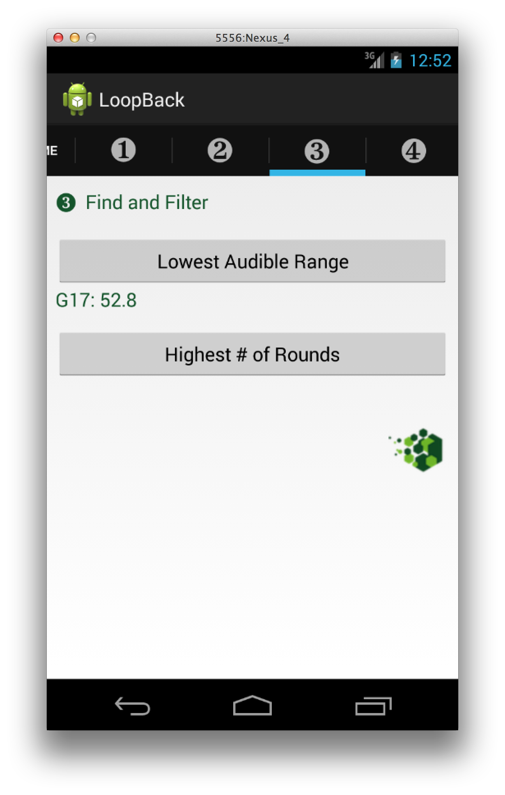

## Getting Started

Once you've got your LoopBack-powered backend running, it's time to integrate
it with your mobile application.

### Prerequisites

Before you start, make sure you have:

 * [Eclipse Android Development Tools](http://developer.android.com/sdk/index.html).
 * Android SDK components (open Tools &gt; Android &gt; SDK Manager to install).
   * Tools &gt; Android SDK Platform-tools 18.1.0.
   * Tools &gt; Android SDK Build-tools 18.1.0.
   * Android 4.3 (API 18) &gt; SDK Platform.
   * Extras &gt; Android Support Repository.
   * Extras &gt; Android Support Library.
 * For on-device testing, an Android device with Android 4 or higher.
 * A LoopBack-powered server application (For example, the StrongLoop Suite
   Example App. [More information here.](http://docs.strongloop.com)).

### Geting Started with the Guide Application

The easiest way to get started with the LoopBack Android SDK
is with the LoopBack Android guide application. The guide application comes
ready to compile with Android Studio and each tab in the application
will guide you through the features available to mobile applications through
the SDK.






From your usual projects directory:

 1. Download the LoopBack guide application to your local machine from
 [GitHub](https://github.com/strongloop/loopback-android-getting-started).

    ```sh
    git clone git@github.com:strongloop/loopback-android-getting-started.git
    ```

 1. Open ADT Eclipse.

 1. Import the Loopback Guide Application to your workspace.

 1. Start the Application. Each tab (fragment) shows a different way
    to interact with the LoopBack server.
    Look at source code of fragments to see implementation details.

### Getting started with the LoopBack SDK

If you are creating a new Android application or want to integrate an existing
application with LoopBack, you'll want to use the LoopBack SDK 
independently of the guide application.

 1. Open the ADT project you want to use with LoopBack, or
    create a new one.

 1. Open the SDKs folder of the distribution:

    ```sh
    open /usr/local/share/strongloop-node/strongloop/sdks/loopback-android-sdk
    ```

 1. Drag all files and folders from the new Finder window into `libs` folder
    of your ADT application.

 1. Somewhere, we're going to need an adapter to tell the SDK where to find our
 server:

    ```java
    RestAdapter adapter = new RestAdapter("http://example.com");
    ```

    This `RestAdapter` provides the starting point for all our interactions
    with the running and anxiously waiting server.

 1. Once we have access to `adapter` (for the sake of example, we'll assume the
 Adapter is available through our Fragment subclass), we can create
 basic `Model` and `ModelPrototype` objects. Assuming we've previously
 created [a model named "product"](http://docs.strongloop.com/loopback#model):

    ```java
    ModelPrototype productPrototype = adapter.createPrototype("product");
    Model pen = productPrototype.createModel(
                    ImmutableMap.of("name", "Awesome Pen"));
    ```

    All the normal, magical `Model` and `ModelPrototype` methods (e.g.
    `create`, `destroy`, `findById`) are now available through
    `productPrototype` and `pen`!

 1. Go forth and develop! Check out the [API docs](ios/api) or create more
 Models with the LoopBack [CLI](http://docs.strongloop.com/loopback#model) or
 [Node API](http://docs.strongloop.com/loopback#a-simple-example).


