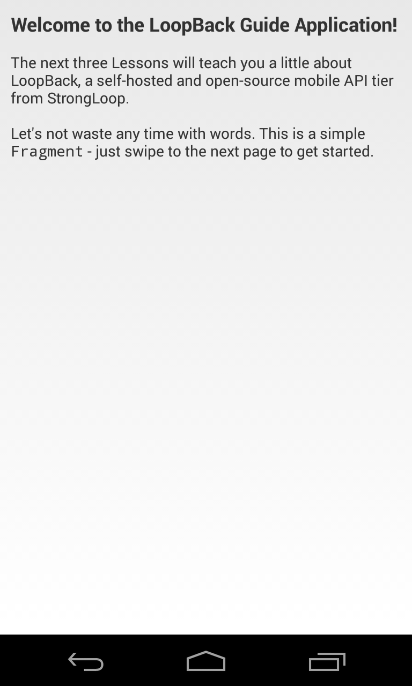
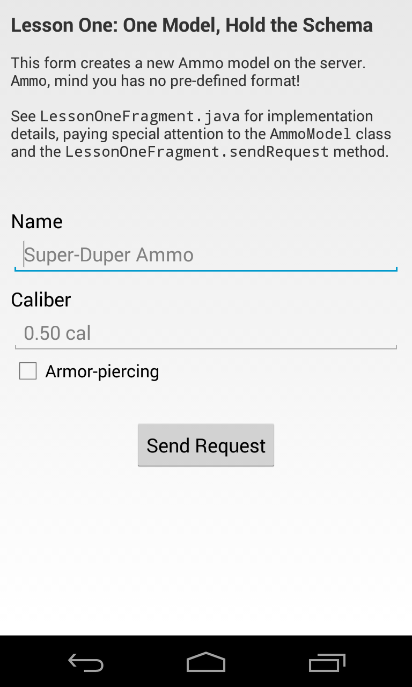
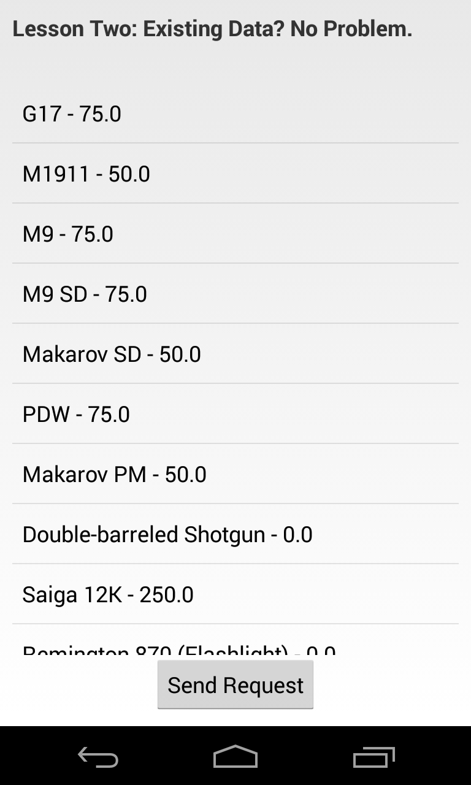
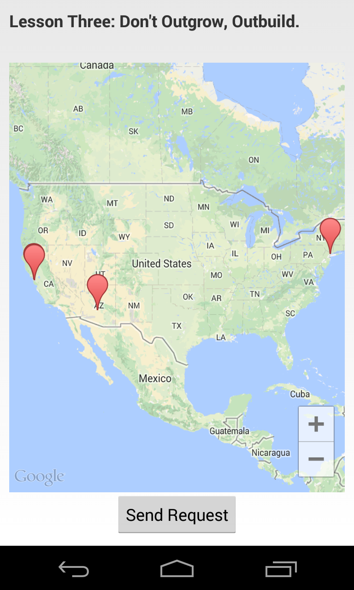
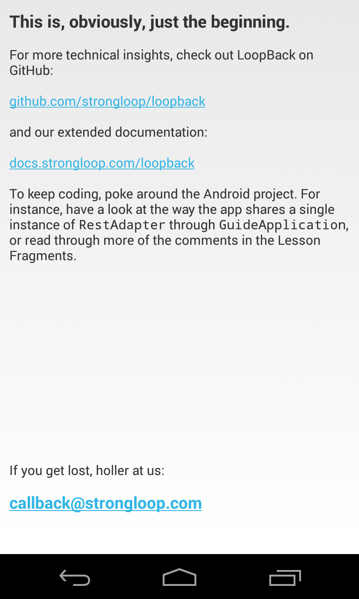

## Getting Started

If you haven't already created your application backend, see the
[LoopBack Quick Start](http://docs.strongloop.com/loopback#quick-start).
Once you've got your LoopBack-powered backend running, it's time to integrate
it with your mobile application.

### Prerequisites

Before you start, make sure you've installed the [Eclipse Android Development Tools](http://developer.android.com/sdk/index.html) (ADT).

Now make sure you have the necesssary SDK tools installed.  

1. In ADT, choose **Window > Android SDK Manager**.
1. Install the following if they are not already installed:

 * Tools:
    * Android SDK Platform-tools 18 or newer
    * Android SDK Build-tools 18 or newer
 * Android 4.3 (API 18) 
    * SDK Platform.

1. To run the LoopBack Android guide application (see below),
   you also need to install

  * Extras
    * Google Play Services

For on-device testing, you need an Android device with Android 4 or higher, or you can use a virtual Android device.
See [AVD Manager](http://developer.android.com/tools/help/avd-manager.html) for more information.

To get the  LoopBack Android guide application, you will need either the [git](http://git-scm.com/) command-line tool
or a GitHub account.

### Getting Started with the Guide App

The easiest way to get started with the LoopBack Android SDK
is with the LoopBack Android guide app. The guide app comes
ready to compile with Android Studio and each tab in the app
will guide you through the SDK features available to mobile apps.

<p style="text-align: center">
  
  
  
  
  
  
</p>

Before you start, make sure you have set up at least one Android virtual device:
Choose **Window > Android Virtual Device Manager**.
See [AVD Manager](http://developer.android.com/tools/help/avd-manager.html)
for more information.

> The guide application uses Google Maps Android API to render a map.
> As of November 2013, Google Maps are not supported by the Android emulator.
> and the application will use an alternate view in such case.
> It's recommended to run the guide on a real Android device to get
> the best user experience.

Start the StrongLoop Suite sample backend application.
In the directory where you installed StrongLoop Suite, enter these commands
```sh
$ cd strongloop/samples/sls-sample-app
$ slc run app
```
 
Now follow these steps to run the LoopBack Android guide app:
 
 1. Download the LoopBack guide application to your local machine from
 [GitHub](https://github.com/strongloop/loopback-android-getting-started).

    ```sh
    $ git clone git@github.com:strongloop/loopback-android-getting-started.git
    ```
  Alternatively, if you have a GitHub account, you can clone or download the repository as a zip file from 
  https://github.com/strongloop/loopback-android-getting-started.

 1. Open ADT Eclipse.

 1. Import the Loopback Guide Application to your workspace:
     1. Choose **File > Import**.
     1. Choose **Android > Existing Android Code into Workspace**.
     1. Click **Next**.
     1. Browse to the `loopback-android-getting-started` directory.
     1. Click **Finish**.

 1. Import Google Play Services library project into your workspace.
    The project is located inside the directory where you have installed
    the Android SDK.
     1. Choose **File > Import**.
     1. Choose **Android > Existing Android Code into Workspace**.
     1. Click **Next**.
     1. Browse to the
      `<android-sdk>/extras/google/google_play_services/libproject/google-play-services_lib`
      directory.
     1. Check **Copy projects into workspace**
     1. Click **Finish**.

  See [Set Up Google Play Services SDK](http://developer.android.com/google/play-services/setup.html)
  instruction for more details.

 1. Add the imported google-play-services\_lib as an Android build dependency
     of the Guide Application.
     1. In the Package Explorer frame, select LoopbackGuideApplication
     1. Choose **File > Project Properties**
     1. Select **Android**
     1. In the Library frame, click on **Add...** and select
        google-play-services\_lib

 1. Obtain an API key for Google Maps Android API v2 per
    [Getting Started instructions](https://developers.google.com/maps/documentation/android/start#get_an_android_certificate_and_the_google_maps_api_key)
    and enter it into AndroidManifest.xml.

 1. Click the green **Run** button in the toolbar to run the application. Each tab (fragment) shows a different way
    to interact with the LoopBack server.
    Look at source code of fragments to see implementation details.

It takes some time for the app to initialize: Eventually, you'll see an Android virtual device window.
Click the LoopBack app icon in the home screen to view the LoopBack Android guide app.

#### Troubleshooting

**Problem**: Build fails with the message `Unable to resolve target 'android-18'`.

**Resolution**: You need to install Android 4.3 (API 18) SDK. See [Prerequisites](#prerequisites) for instructions on how to
install SDK components.

If you don't want to install an older SDK and want to use the most recent one 
(for example, Android 4.4 API 19), follow these steps:

1. Close Eclipse ADT.
1. Edit the file `project.properties` in the `loopback-android-getting-started` directory and change 
 the `target` property to the API version you have installed. For example: `target=android-19`.
1. Open Eclipse ADT again. The project should build correctly now.

### Getting started with the LoopBack SDK

If you are creating a new Android application or want to integrate an existing
application with LoopBack, then use the LoopBack SDK 
independently of the guide application.

#### Eclipse ADT setup

Follow these steps to add LoopBack SDK to your Eclipse project:

 1. Download Android SDK bundle for Eclipse from Maven Central:
    1. Open repository browser: http://search.maven.org/#browse%7C471080988
    1. Select the version you would like to use, e.g. 1.1.0
    1. Download the file `loopback-android-{version}-eclipse-bundle.zip` file, e.g.
       `loopback-android-1.1.0-eclipse-bundle.zip`

 1. Extract the content of the downloaded ZIP file into `libs` folder of your
    ADT application.

#### Android Studio setup
 1. Edit your build.gradle file
 1. Make sure you have `mavenCentral()` among the configured repositories:
  ```groovy
  repositories {
      mavenCentral()
  }
  ```
 1. Add `com.strongloop:loopback-android:1.+` to your compile dependencies:
 ```groovy
 dependencies {
     compile 'com.strongloop:loopback-android:1.+'
 }
 ```

#### Working with the SDK

 1. Somewhere, we're going to need an adapter to tell the SDK where to find our
 server:

    ```java
    RestAdapter adapter = new RestAdapter("http://example.com");
    ```

    This `RestAdapter` provides the starting point for all our interactions
    with the running server.

 1. Once we have access to `adapter` (for the sake of example, we'll assume the
 Adapter is available through our Fragment subclass), we can create
 basic `Model` and `ModelRepository` objects. Assuming we've previously
 created [a model named "product"](http://docs.strongloop.com/loopback#model):

    ```java
    ModelRepository productRepository = adapter.createRepository("product");
    Model pen = productRepository.createModel(
                    ImmutableMap.of("name", "Awesome Pen"));
    ```

    All the normal, magical `Model` and `ModelRepository` methods (for example,
    `create`, `destroy`, `findById`) are now available through
    `productRepository` and `pen`!

 1. Go forth and develop! Check out the [API docs](http://docs.strongloop.com/loopback-android/api/index.html) or create more
 Models with the LoopBack [CLI](http://docs.strongloop.com/loopback#model) or
 [Node API](http://docs.strongloop.com/loopback#a-simple-example).


